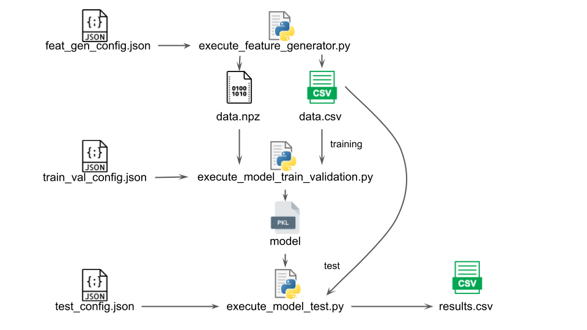

# Automotive Ethernet IDS Evaluation Framework

## Table of contents

- [Introduction](#introduction)
- [Getting started](#getting-started)
    - [Executing the feature generator script](#feat-gen)
    - [Executing the model training and validation script](#train-val)
    - [Exeucuting the model test script](#test)
- [Folders structure](#folders)
- [Citting us](#citting-us)

<a name="introduction"> </a>
## Introduction

This repository contains some of the efforts of the CIn-UFPE Connected Systems Lab
on developing new Intrusion Detection Systems (IDSs) for Automotive Ethernet networks.

The main idea of this repository is to contain the code of our work and also the reproduction
code of other related work to automotive Ethernet intrusion detection. Therefore, the scripts
were constructed to be easily extensible to include new datasets and IDSs that are based
on Machine Learning and Deep Learning techniques.

This repository currently contains the code to reproduce the following work:

- [Multi-Stage Deep Learning-Based Intrusion Detection System for Automotive Ethernet Network](https://papers.ssrn.com/sol3/papers.cfm?abstract_id=4658006)
- [Convolutional neural network-based intrusion detection system for AVTP streams in automotive Ethernet-based networks](https://www.sciencedirect.com/science/article/abs/pii/S2214209621000073)

<a name="getting-started"> </a>
## Getting started

The first step is to prepare the python virtual environment with the necessary libraries. We have prepared a Makefile to help with this setup, to prepare the environment, simply run:

```console
make bootstrap
```

Once you have the libraries properly installed in the virtual environment, the next step is to activate the virtual environment. To do so, run the following command:

```console
source venv/bin/activate
```

Once the virutal environment is properly activated, we can move on to use our entrypoint scripts. We have the following entrypoint scripts:

- execute_feature_generator.py
- execute_model_train_validation.py
- execute_model_test.py

Each script uses as input a json configuration file that contain the information necessary for the script execution. The script output depends on the script, but it can vary from data in different formats and trained models to be further used in other scenarios.

These scripts should be ideally executed sequentially with the output of the previous scripts. They were kept separated to ease the experimentation of different kind of parameters that do not require changes in the other scripts.

The overall interaction between the scripts is presented in the following image:

<p align="center">
  
</p>

In the following subsections we will present a simple use of each script.

<a name="feat-gen"> </a>
### Executing the feature generator script

The main purpose of the feature generator script is to transform raw input data into meaningful features according to the feature generation specification. To execute the feature generator script with a sample input file called feat_gen_config.json, simply run:

```console
python3 execute_feature_generator.py --feat_gen_config feat_gen_config.json
```

The content of feat_gen_config.json could be:
```json
feat_gen_config.json
{
    "feature_generator": "CNNIDSFeatureGenerator",
    "config": {
        "window_size": 44,
        "window_slide": 1,
        "number_of_bytes": 58,
        "multiclass": false,
        "labeling_schema": "AVTP_Intrusion_dataset",
        "dataset": "AVTP_Intrusion_dataset",
        "suffix": "test",
        "sum_x": true
    },
    "paths": {
        "injected_only_frame_path": "/path/to/file",
        "injected_data_paths" : ["/path/to/file1", "path/to/file2"],
        "output_path": "/output/path"
    }
```

The output artifacts will be placed in the specific output path.

**__NOTE:__** It is important to mention that the name of the generated output files may differ from the ones that are under "config_jsons" folder. For this reason, it will be necessary to update your configuration json to match the name of your own output files.

<a name="train-val"> </a>
### Executing the model training and validation script

To execute the model training and validation script with a config file named train_val_config.json, simply run:

```console
python3 execute_model_train_validation.py --model_train_valid_config train_val_config.json
```

A sample content of the train_val_config.json:
```json
train_val_config.json
{
    "feat_gen": {
        "feature_generator": "CNNIDSFeatureGenerator",
        "config": {
            "window_size": 44,
            "window_slide": 1,
            "number_of_bytes": 58,
            "multiclass": false,
            "labeling_schema": "AVTP_Intrusion_dataset",
            "dataset": "AVTP_Intrusion_dataset"
        },
        "load_paths": {
            "X_path": "/path/to/train/x/data",
            "y_path": "/path/to/train/y/data"
        }
    },
    "model_specs": {
        "framework": "pytorch",
        "model": "CNNIDS",
        "model_name": "CNNIDS",
        "criterion": "binary-cross-entropy",
        "hyperparameters": {
            "batch_size": 64,
            "learning_rate": 0.001,
            "num_epochs": 1,
            "early_stopping_patience": 5,
            "num_outputs": 1
        },
        "paths": {
            "metrics_output_path":"/path/to/metric/output",
            "models_output_path":"/path/to/model/output"
        }
    }
```

<a name="test"> </a>
### Executing the model test script

Finally, to execute the model test script with a config named test.config, simply run:

```console
python3 execute_model_test.py --model_test_config test_config.json
```

A sample content of the test_config.json:
```json
test_config.json
{
    "feat_gen": {
        "feature_generator": "CNNIDSFeatureGenerator",
        "config": {
            "window_size": 44,
            "window_slide": 1,
            "number_of_bytes": 58,
            "multiclass": false,
            "labeling_schema": "AVTP_Intrusion_dataset",
            "dataset": "AVTP_Intrusion_dataset"
        },
        "load_paths": {
            "X_path": "/path/to/train/x/data",
            "y_path": "/path/to/train/y/data"
        }
    },
    "model_specs": {
        "framework": "pytorch",
        "model": "CNNIDS",
        "model_name": "CNNIDS",
        "criterion": "binary-cross-entropy",
        "hyperparameters": {
            "batch_size": 64,
            "learning_rate": 0.001,
            "num_epochs": 1,
            "early_stopping_patience": 5,
            "num_outputs": 6
        },
        "paths": {
            "metrics_output_path":"/path/to/metric/output",
            "models_output_path":"/path/to/model/output"
        },
        "presaved_paths": {
            "0": "/path/to/model/trained/in/fold/0",
            "1": "/path/to/model/trained/in/fold/1",
            "2": "/path/to/model/trained/in/fold/2",
            "3": "/path/to/model/trained/in/fold/3",
            "4": "/path/to/model/trained/in/fold/4"
        }
    }
}
```

#### Running only for timing measurements

It is important to notice that when you are focusing on only timing measurements to evaluate the detection time, it is not necessary to load the entire dataset, as it would delay the measurements and difficult experimentation.

For this reason, we have provided the "sample_inputs/" folder, that contains smaller samples from the test data that are loaded as fast as possible. To use this files, we have also provided some sample configs that are under "config_jsons/test_detection_time". Please keep in mind that the accuracy related metrics generated with the samples files are not reliable, as the input dataset is only a small subset of all data.


<a name="folders"> </a>
## Folder structure

This repository is organized in the following folder structure:

- config_jsons/
    - feat_generator/
        - AVTP_CNNIDS_train.json
        - ...
    - model_test/
        - TOW_MultiStage_test.json
        - ...
    - model_train_validate/
        - AVTP_CNNIDS_train.json
        - ...
    ...
- custom_metrics/
- sample_inputs/
- feature_generator/
    - abstract_feature_generator.py
    - cnn_ids_feature_generator.py
    - ...
- model_train_validation/
    - abstract_model_train_validate.py
    - pytorch_model_train_validate.py
    - ...
- model_test/
    - abstract_model_test.py
    - pytorch_model_test.py
    - ...
- models/
    - conv_net_ids.py
    - multiclass_conv_net_ids.py
    - pruned_conv_net_ids.py
    - sklearn_classifier.py
    - ...
- execute_feature_generator.py
- execute_model_train_validation.py
- execute_model_test.py
- Makefile
- README.md
- requirements.txt
- run_framework.sh


<a name="citting-us"> </a>
## Citing us

If you use the code in this repository in your research, please cite our original work:

```
Marques da Luz, Luigi F. and Freitas de Araujo-Filho, Paulo and Campelo, Divanilson R., Multi-Stage Deep Learning-Based Intrusion Detection System for Automotive Ethernet Networks. Available at SSRN: https://ssrn.com/abstract=4658006 or http://dx.doi.org/10.2139/ssrn.4658006
```
